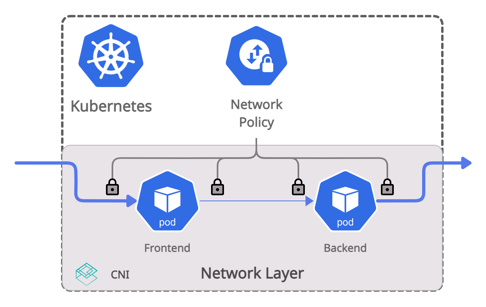
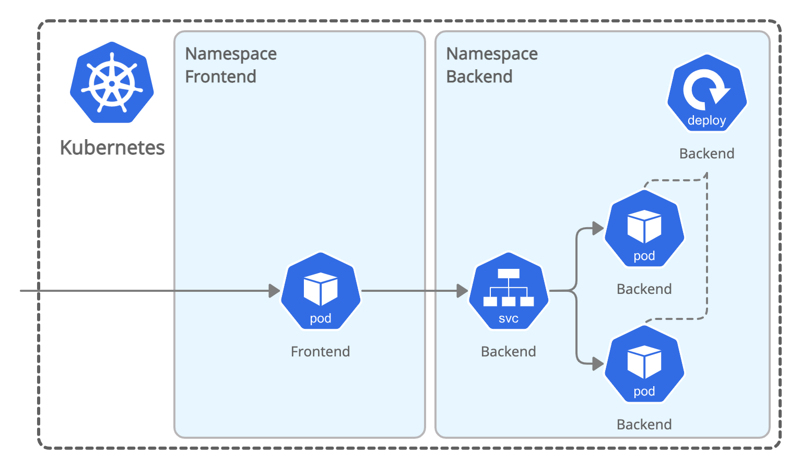
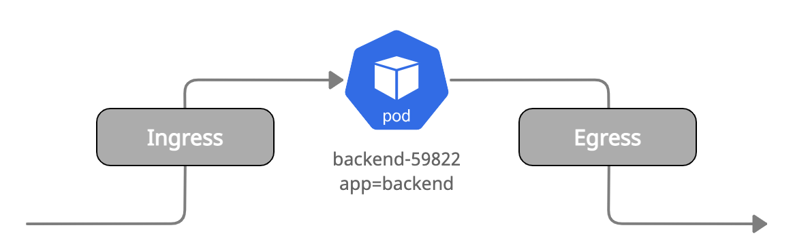
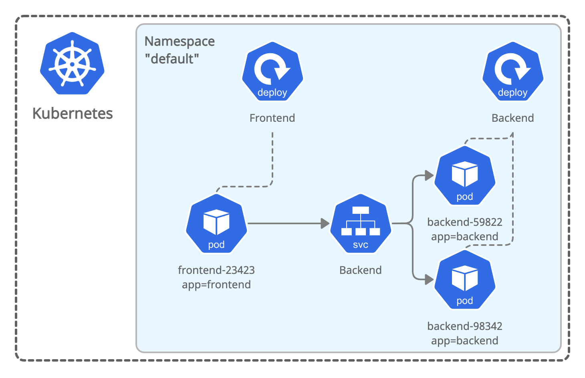
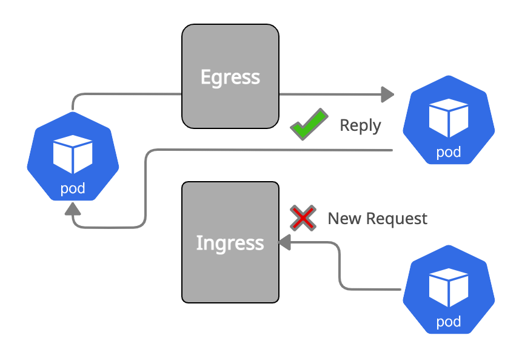
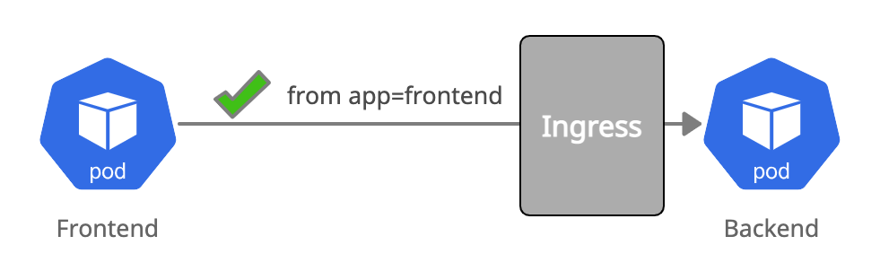
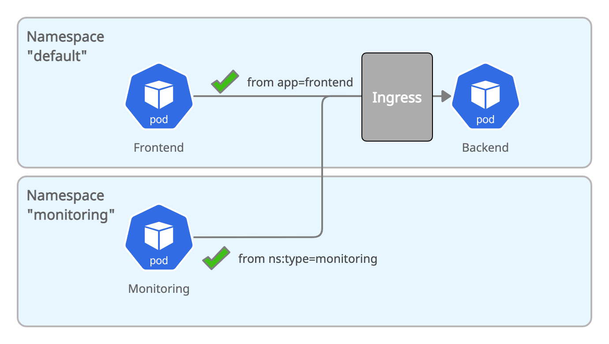
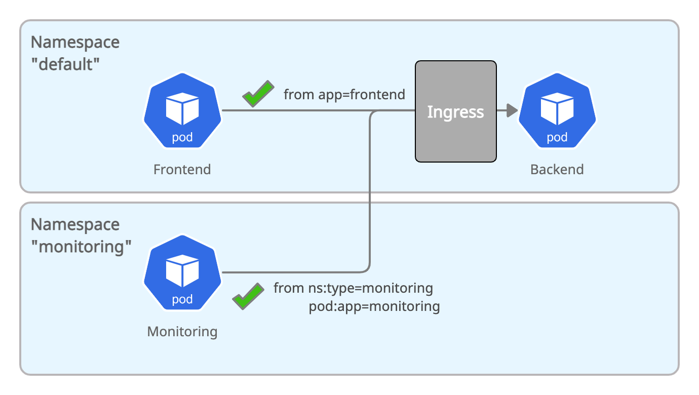
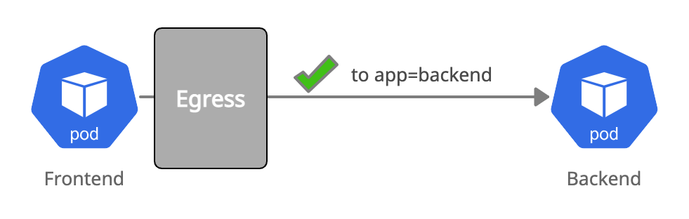
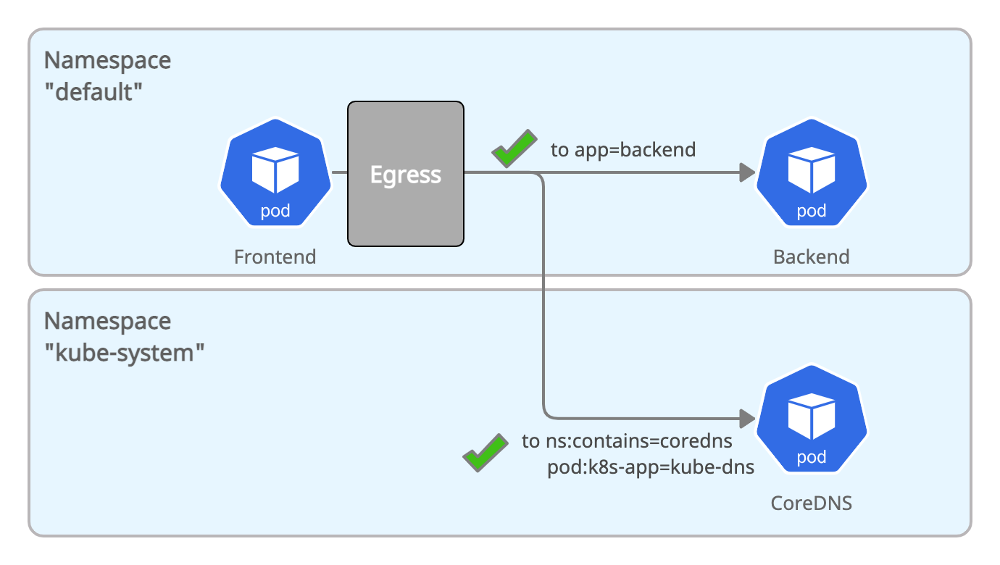

# NetworkPolicy Tutorial

Welcome! 👋 This tutorial helps you get started with Kubernetes NetworkPolicy.

## What is Kubernetes NetworkPolicy?

NetworkPolicy is a standardized Kubernetes object to control the allowed network traffic patterns between Kubernetes pods and namespaces as well as any traffic entering or leaving the cluster.
However, Kubernetes itself does not provide an implementation of NetworkPolicy, it is typically provided by the [CNI plugin].
If no NetworkPolicy is loaded, all communication is allowed which is clearly violating least-privilege and zero-trust security privileges.
For more information on the concept, see [Network Policies](https://kubernetes.io/docs/concepts/services-networking/network-policies/) in the Kubernetes documentation.

## What will you learn in this Tutorial?

In this tutorial, we will cover the following topics:

* Fundamentals:
  * Kubernetes 101
  * Default Allow & Default Deny
  * Ingress & Egress
* Ingress Controls
  * Putting a pod into ingress default deny
  * Allow pod to pod connectivty (ingress)
  * Allow everything within a namespace (ingress)
  * Allow across namespaces
* Egress Controls
  * Putting a pod into egress default deny
  * Allow pod to pod connectivity
  * Allow Kubernetes DNS (across namespaces)

# Getting Started: Create a Kubernetes Cluster with a CNI

In order to enforce Kubernetes NetworkPolicies, your cluster must be running
with a
[CNI](https://kubernetes.io/docs/concepts/extend-kubernetes/compute-storage-net/network-plugins/)
that is capable of enforcing NetworkPolicies. Multiple options exist, for this
tutorial we will be using [Cilium](https://github.com/cilium/cilium) as it
provides nice visibility tooling to help us illustrate things as we go along.

If you already have a Kubernets cluster with an appropriate CNI plugin
installed, then skip the following steps.

## Create a Cluster

### GKE

    export CLUSTER_NAME=test-$(whoami)-$RANDOM
    export CLUSTER_ZONE=us-west2-a
    gcloud container clusters create $CLUSTER_NAME --image-type COS --num-nodes 2 --machine-type n1-standard-4 --zone $CLUSTER_ZONE
    gcloud container clusters get-credentials $CLUSTER_NAME --zone $CLUSTER_ZONE

### minikube

    minikube start --network-plugin=cni

## Install Cilium

**Note:** You can install and use any CNI that supports NetworkPolicy to complete this tutorial. Skip this section if already have a CNI installed with NetworkPolicy.

### Darwin

    curl -LO https://github.com/cilium/cilium-cli/releases/download/v0.4/cilium-darwin-amd64.tar.gz
    tar xzvf cilium-darwin-amd64.tar.gz
    sudo mv cilium /usr/local/bin
    cilium install
    cilium status

### Linux

    curl -LO https://github.com/cilium/cilium-cli/releases/download/v0.4/cilium-linux-amd64.tar.gz
    tar xzvf cilium-linux-amd64.tar.gz
    sudo mv cilium /usr/local/bin
    cilium install
    cilium status


## Enable Hubble (Optional)

If you want, you can enable Hubble to get a fully distributed network monitor
that will show you every forwarding and drop decision in your cluster.

1. [Install Hubble](https://github.com/cilium/hubble/releases)
2. Enable Hubble in Cilium:

        cilium hubble enable

3. Add a port forward with `kubectl` to expose Hubble. You can obviously also
   expose a `LoadBalancer` service if you want but for the simplicity of this
   tutorial, a `port-forward` is the simplest solution:

        kubectl port-forward -n kube-system deployment/hubble-relay 4245:4245&

4. Run `hubble observe` to start observing all network traffic in the default namespace:

        hubble observe --server localhost:4245 -f -n default

# Fundamentals

NetworkPolicy is a standardized Kubernetes object to control the allowed network traffic patterns between Kubernetes pods and namespaces as well as any traffic in and out of a cluster.
However, Kubernetes itself does not provide an implementation of NetworkPolicy, it is typically provided by the [CNI plugin].
If no NetworkPolicy is loaded, all communication is allowed which is clearly violating least-privilege and zero-trust security privileges.
It is thus in the best interest of any Kubernetes cluster operator to understand and use the concept of NetworkPolicy.



When referring to NetworkPolicy more broadly, users may refer to both the standard Kubernetes NetworkPolicy as well as the extended version with additional capabilities specific to the selected [CNI plugin], e.g. [CiliumNetworkPolicy].
These extended versions are typically implemented as [Custom Resources](https://kubernetes.io/docs/concepts/extend-kubernetes/api-extension/custom-resources/).
In the initial chapters of this tutorial, we will focus on Kubernetes NetworkPolicy and then dive into some of the extensions to understand benefits and tradeoffs.

### 101 - Namespaces, Pods, & Services

In order to understand NetworkPolicy, you need to understand the basics of Kubernetes objects.
This is a quick 101 of the Kubernetes objects that are relevant for NetworkPolicy.
If you are already familiar with Kubernetes objects, feel free to skip this section.
If are looking for a more detailed introduced, refer to the Kubernetes documentation [Working with Kubernetes Objects](https://kubernetes.io/docs/concepts/overview/working-with-objects/).



### [Namespaces](https://kubernetes.io/docs/concepts/overview/working-with-objects/namespaces/)

A namespace groups Kubernetes objects into a specific context.
If you want, you can consider it a virtual cluster.
Namespaces allow to share a cluster among multiple tenants.
In the context of NetworkPolicy, it is most common to define the scope of a NetworkPolicy to only apply within a particular namespace and specifically handle any cross-namespace communication.
More on this later.

### [Pods](https://kubernetes.io/docs/concepts/workloads/pods/)

Pods are the smallest deployable unit of an application that you can create and manage. Pods are typically created via a higher-level object such as a [Deployments](https://kubernetes.io/docs/concepts/workloads/controllers/deployment/), [DaemonSets](https://kubernetes.io/docs/concepts/workloads/controllers/daemonset/), [Jobs](https://kubernetes.io/docs/concepts/workloads/controllers/job/), [StatefulSets](https://kubernetes.io/docs/concepts/workloads/controllers/cron-jobs/), etc. and are deployed directly into a particular [Namespace](https://kubernetes.io/docs/concepts/overview/working-with-objects/namespaces/). A pod consist of one or more application containers which all share the same storage and network resources and always run on the same host. If your application is scalable and deployed with multiple replicas then each replica is deployed as an individual pod.
Pods can be assigned a set of [Labels](https://kubernetes.io/docs/concepts/overview/working-with-objects/labels/). These labels allow to select any number of pods and treat them in artbirary groups using [Selectors](https://kubernetes.io/docs/concepts/overview/working-with-objects/labels/#label-selectors). In the context of NetworkPolicy, a policy is applied to one or more pods by selecting pod labels in the NetworkPolicy. The policy is then applied to all application containers of any pod that matches the label selector.

### [Services](https://kubernetes.io/docs/concepts/services-networking/service/)

Applications running as pods are made available to other pods and to external clients using services. A service makes a set of pods available using an internal or external IP address and assigns a stable DNS name to this IP to allow for the discovery of the service by other pods. In the context of NetworkPolicy, services typically play a minor role as policies are applied to pods directly but use of services can influence how NetworkPolicy has to be defined.

If you want to deepen your understanding of Kubernets objects before continuing, feel free to dive into the [Kubernetes Concepts](https://kubernetes.io/docs/concepts/) chapters of the Kubernetes documentation.

### Default Allow & Default Deny

In the absence of any NetworkPolicy, the default behavior of a Kubernetes
cluster is to allow everything on the network. It is your responsibility as an
operator of a Kubernetes cluster to create NetworkPolicy objects to change
the **default allow** setting to **default deny**  and the explicitely allow
all required traffic paterns.

If your Kubernetes cluster is already running many applications, this may appear difficult as changing from a **default allow** to a **default deny** security model in a single step may appear challenging. Fortunately, NetworkPolicy allows to change the **default deny** setting for individual groups of pods or individual namespaces so you can start locking down the most important applications first and improve your security posture step by step.

Before we now create our first NetworkPolicy, we need to understand one more fundamental concept:

### Ingress & Egress
Ingress and egress are terms used in networking to describe traffic direction. Ingress refers to network traffic that is transmitted into a Kubernetes pod and egress is refers to network traffic that is emmited by a pod.



The **default deny** setting of a pod can be control for each traffic direction separately, i.e., you can initially deny all traffic into a pod and start allowing individual traffic patterns while still allowing all network traffic leaving a pod.

# Ingress Controls

We are now ready to create our first NetworkPolicy to put a set of pods into **default deny** and then allow a set of network traffic.

## Create Demo App

Create the following demo-app in your Kubernetes cluster. The examples will assume that you deploy the demo app into the `default` namespace but you can of course use any namespace and adjust the examples accordingly.
``` bash
kubectl create -f tutorial/demo-app.yaml
```



Validate that you have `frontend` and `backend` pods running:
``` bash
kubectl get pods,svc
NAME                            READY   STATUS    RESTARTS   AGE
pod/backend-69d87c4548-kx4sz    1/1     Running   0          8m18s
pod/frontend-6864ff68cc-7r2fc   1/1     Running   0          8m18s

NAME                 TYPE        CLUSTER-IP      EXTERNAL-IP   PORT(S)    AGE
service/backend      ClusterIP   10.100.105.40   <none>        8080/TCP   8m19s
```

In order to simplify execution of commands in the pods, store the pod names in shell variables:

``` bash
FRONTEND=$(kubectl get pods -l app=frontend -o json | jq -r '.items[0].metadata.name')
BACKEND=$(kubectl get pods -l app=backend -o json | jq -r '.items[0].metadata.name')
```

Finally, validate that the `frontend` pod can talk to the `backend` pod:

``` bash
kubectl exec -ti $FRONTEND -- curl -I backend:8080 | head -1
HTTP/1.1 200 OK
```

## Putting a Pod into ingress default deny mode
The following policy ([01-backend-ingress-deny.yaml](https://app.networkpolicy.io/?policy-url=https://raw.githubusercontent.com/cilium/network-policy-tutorial/master/tutorial/01-backend-ingress-deny.yaml)) will put the `backend` pod into **default deny** mode for the ingress direction. The pod will no longer be able to receive any traffic until we allow it but it can still egress all traffic.

``` yaml
kind: NetworkPolicy
apiVersion: networking.k8s.io/v1
metadata:
  name: backend-ingress-deny
spec:
  podSelector:
    matchLabels:
      app: backend
  policyTypes:
  - Ingress
```

Create the above policy in your cluster:

``` bash
kubectl create -f tutorial/01-backend-ingress-deny.yaml
```

A connection from `frontend` to `backend` will now timeout:

``` bash
kubectl exec -ti $FRONTEND -- curl -I --connect-timeout 5 backend:8080
curl: (28) Connection timed out after 5001 milliseconds
command terminated with exit code 28
```

However, the `backend` can still reach kubernetes.io:

``` bash
kubectl exec -ti $BACKEND -- curl -I kubernetes.io | head -1
HTTP/1.1 301 Moved Permanently
```

Looking at the specific policy, there is no mention of **deny**, why did it put the pod into **default deny**? Let's inspect the policy in steps to understand each part:

1. The first part of the policy will be common among all policies, it describes the kind of Kubernetes object and the name of the policy:

    ```
    kind: NetworkPolicy
    apiVersion: networking.k8s.io/v1
    metadata:
      name: backend-ingress-deny
    ```

2. The next part describes the `podSelector` which is the [Selector] to describe which pods this policy should apply to.
    ```
    spec:
      podSelector:
        matchLabels:
          app: backend
    ```

    As NetworkPolicy objects are [namespaced](https://kubernetes.io/docs/concepts/overview/working-with-objects/namespaces/#not-all-objects-are-in-a-namespace) a policy will only have effect in the namespace the policy has been created in. The above `podSelector` selects all pods in the namespace with the label `app: backend`. If our `backend` demo-app would be running as multiple replicas, then all replicas would be selected.

3. The final part describes rules that specify what is allowed. As soon as a pod is selected by a NetworkPolicy it will change its default security posture from **default allow** to **default deny** in any direction for which rules are specified. For such pods, only traffic matching a rule will be allowed going forward:


    ```
    spec:
      policyTypes:
      - Ingress
    ```

    The above example is YAML syntax to specify an empty list and thus says that nothing is allowed in the ingress direction.

## What is Stateful Policy Enforcement?

In the previous chapter, we put the ingress direction of the`backend` pod into
**default deny**. How was it possible for kubernetes.io to still be reachable
from within that pod. Shouldn't the reply packets of the network connection to
kubernetes.io have been dropped?

The reason why the example worked is because NetworkPolicy is typically
enforced in a stateful manner. This is not required by the NetworkPolicy
specification and will depend on the selected [CNI plugin] but stateful
enforcement is the norm and typically expected by users.



Stateful enforcement enables allowing a network connection in the forward direction only and let the stateful enforcement automatically allow reply network traffic for known network connections. It is called stateful is because the [CNI plugin] will maintain state to keep track of all active network connections and associate all network packets to a connection in either the forward or reply direction.

## Allowing Pod to Pod connectivity



Next, with the `backend` pod in ingress **default deny**, we will specifically allow the `frontend` pod to reach the `backend` ([02-backend-ingress-allow-frontend.yaml](https://app.networkpolicy.io/?policy-url=https://raw.githubusercontent.com/cilium/network-policy-tutorial/master/tutorial/02-backend-ingress-allow-frontend.yaml)):

``` yaml
kind: NetworkPolicy
apiVersion: networking.k8s.io/v1
metadata:
  name: backend-ingress-allow-frontend
spec:
  podSelector:
    matchLabels:
      app: backend
  ingress:
    - from:
      - podSelector:
          matchLabels:
            app: frontend
```

Most aspects look similar to the previous policy, look at what is new:

```yaml
spec:
  ingress:
    - from:
      - podSelector:
          matchLabels:
            app: frontend
```

Instead of an empty list, the above policy contains a rule that allows `from` a set of pods described as a `podSelector`. All pods which match the `podSelector` will be allowed. The `podSelector` uses the standard  selector syntax that you might be familiar from other Kubernetes objects so you can also use sets and expressions to specify what pods should be allowed.

 Import the above policy in your cluster and validate that the connectivity works again:
``` bash
kubectl create -f tutorial/02-backend-ingress-allow-frontend.yaml
kubectl exec -ti $FRONTEND -- curl -I backend:8080 | head -1
HTTP/1.1 200 OK
```

You will now have two policies created in your namespace:

```
kubectl get networkpolicies
NAME                             POD-SELECTOR   AGE
backend-ingress-allow-frontend   app=backend    1h
backend-ingress-deny             app=backend    1h
```

This highlights another key aspect of NetworkPolicy: Policies are additive. If you create multiple policies that select the same pod then all rules specified in all policies are added together and will apply to the pod. In our example, the `backend-ingress-deny` policy puts the pod into ingress **default deny** mode and the `backend-ingress-allow-frontend` allows network communication from `frontend`. Technically, the `backend-ingress-deny` policy is no longer needed as the `backend-ingress-allow-frontend` policy also puts the pod into **default deny**. However, you will find that using a separate policy for **default deny** is preferred as it avoids accidental exposure of a pod on the removal of the allow policy. It also enables you to put all pods of a namespace into **default deny** and then describe allow rules for each deployment in a separte policy.

## Allowing Everything in a Namespace

While it is clearly desirable to define all allowed network communication on a per pod level to achieve least-privilege security, doing so might be quite involved in your environment. Allowing everything within namespaces while denying cross namespace and external access can be a simple first step while already improving your security posture overall
([03-all-pods-allow-within-namespace.yaml](https://app.networkpolicy.io/?policy-url=https://raw.githubusercontent.com/cilium/network-policy-tutorial/master/tutorial/03-all-pods-allow-within-namespace.yaml)):

```yaml
apiVersion: networking.k8s.io/v1
kind: NetworkPolicy
metadata:
  name: all-pods-ingress-allow-within-namespace
spec:
  podSelector: {}
  ingress:
    - from:
      - podSelector: {}
```

The above policy will apply to all pods in the namespace and allow from any other pod in the same namespace:

1. The `{}` is YAML syntax for an empty object. An empty `podSelector` will select all pods in the namespace.:

    ``` yaml
    spec:
      podSelector: {}
    ```

2. Similarly, the `{}` in the ingress `podSelector` will allow from all pods within the namespace

    ```yaml
    spec:
      ingress:
        - from:
          - podSelector: {}
    ```

Create the above policy and validate that connectivity still works:
``` bash
kubectl create -f tutorial/03-all-pods-allow-within-namespace.yaml
kubectl exec -ti $FRONTEND -- curl -I backend:8080 | head -1
HTTP/1.1 200 OK
```

This is not surprising as we also still have the policy `backend-ingress-allow-frontend` loaded. Let's remove that policy and rely on `all-pods-ingress-allow-within-namespace` to allow from the `frontend` pod to the `backend` pod:

1. Delete the policy `backend-ingress-allow-frontend`:

    ``` bash
    kubectl delete networkpolicy backend-ingress-allow-frontend
    networkpolicy.networking.k8s.io "backend-ingress-allow-frontend" deleted
    ```
2. Validate that the connectivity still works:
    ```bash
    kubectl exec -ti $FRONTEND -- curl -I backend:8080 | head -1
    HTTP/1.1 200 OK
   ```

## Allowing Across Namespaces



If an empty `podSelector` matches everything in a namespace, how can we allow network communication across namespaces? This is where the `namespaceSelector` comes in
([04-backend-ingress-allow-monitoring-namespace.yaml](https://app.networkpolicy.io/?policy-url=https://raw.githubusercontent.com/cilium/network-policy-tutorial/master/tutorial/04-backend-ingress-allow-monitoring-namespace.yaml)):

``` yaml
apiVersion: networking.k8s.io/v1
kind: NetworkPolicy
metadata:
  name: backend-ingress-allow-other-namespace
spec:
  podSelector:
    matchLabels:
      app: backend
  ingress:
    - from:
        - namespaceSelector:
            matchLabels:
              type: monitoring
```

Allowing across namespaces is required when an otherwise isolated application running in its own namespace requires to access another application. A typical example is [Prometheus](https://prometheus.io/) running in a separate namespace accessing other pods to scrape metrics over the network.

Let's try this out. Create a new namespace `monitoring`, assign the label `type: monitoring` to it, and deploy the monitoring demo-app into the new namespace:

``` bash
kubectl create namespace monitoring
kubectl label namespace monitoring type=monitoring
kubectl -n monitoring create -f tutorial/monitoring-app.yaml
```

Also store the pod name of the new `monitoring` deployment so we can `exec` from it:
``` bash
MONITORING=$(kubectl -n monitoring get pods -l app=monitoring -o json | jq -r '.items[0].metadata.name')
```

Remember that the security posture of all pods in the `default` namespace is to only allow ingress from within the same namespace. Verify that connectivity is indeed denied from the new `monitoring` namespace:

``` bash
kubectl -n monitoring exec -ti $MONITORING -- curl -I --connect-timeout 5 backend.default.svc.cluster.local:8080 | head -1
curl: (28) Connection timed out after 5001 milliseconds
command terminated with exit code 28
```

Now, create the policy `backend-ingress-allow-monitoring-namespac` to allow namespaces with the label `type: monitoring` to access the `backend` pod:

``` bash
kubectl create -f tutorial/04-backend-ingress-allow-monitoring-namespace.yaml
```

And validate that connectivity is now allowed:

``` bash
kubectl -n monitoring exec -ti $MONITORING -- curl -I backend.default.svc.cluster.local:8080 | head -1
HTTP/1.1 200 OK
```

### Combining podSelector and namespaceSelector



To improve the security posture further, the `namespaceSelector` can be combined with a `podSelector` to only allow certain pods from the namespace
([05-backend-ingress-allow-monitoring-app.yaml](https://app.networkpolicy.io/?policy-url=https://raw.githubusercontent.com/cilium/network-policy-tutorial/master/tutorial/05-backend-ingress-allow-monitoring-app.yaml)):

``` yaml
apiVersion: networking.k8s.io/v1
kind: NetworkPolicy
metadata:
  name: backend-ingress-allow-monitoring-namespace
spec:
  podSelector:
    matchLabels:
      app: backend
  ingress:
    - from:
        - namespaceSelector:
            matchLabels:
              type: monitoring
          podSelector:
            matchLabels:
              app: monitoring
```

Validate that this works by creating this new policy and then removing the previous policy we have created:

``` bash
kubectl create -f tutorial/05-backend-ingress-allow-monitoring-app.yaml
kubectl delete networkpolicy backend-ingress-allow-monitoring-namespace
kubectl -n monitoring exec -ti $MONITORING -- curl -I backend.default.svc.cluster.local:8080 | head -1
HTTP/1.1 200 OK
```

# Egress - Controlling what network traffic a pod can send

## Putting a Pod into egress default deny mode

Following the example on how to put ingress into **default deny**, the same technique can be applied to egress as well but this time, we select the `frontend` pod
([06-frontend-egress-deny.yaml](https://app.networkpolicy.io/?policy-url=https://raw.githubusercontent.com/cilium/network-policy-tutorial/master/tutorial/06-frontend-egress-deny.yaml)):

```yaml
kind: NetworkPolicy
apiVersion: networking.k8s.io/v1
metadata:
  name: frontend-egress-deny
spec:
  podSelector:
    matchLabels:
      app: frontend
  policyTypes:
  - Egress
```

Create the egress default deny policy and validate that the `frontend` pod can't reach the `backend` pod anymore:
``` bash
kubectl create -f tutorial/06-frontend-egress-deny.yaml
kubectl exec -ti $FRONTEND -- curl -I --connect-timeout 5 backend:8080 | head -1
curl: (28) Resolving timed out after 5000 milliseconds
command terminated with exit code 28
```

This is despite having an ingress policy loaded which allows the `backend` pod to receive network traffic from a `frontend` pod.

> If both ingress and egress policies are in play, both have to allow the network traffic in order for the connection to be allowed.

## Allowing Pod to Pod connectivity



Allowing pod to pod in the egress direction works exactly the same as for ingress
([07-frontend-egress-allow-to-backend.yaml](https://app.networkpolicy.io/?policy-url=https://raw.githubusercontent.com/cilium/network-policy-tutorial/master/tutorial/07-frontend-egress-allow-to-backend.yaml)):

```yaml
kind: NetworkPolicy
apiVersion: networking.k8s.io/v1
metadata:
  name: frontend-egress-allow-to-backend
spec:
  podSelector:
    matchLabels:
      app: frontend
  policyTypes:
  - Egress
  egress:
    - to:
      - podSelector:
          matchLabels:
            app: backend
```

Import the policy:

``` bash
kubectl create -f tutorial/07-frontend-egress-allow-to-backend.yaml
```

Test your newly allowed connection:

```bash
kubectl exec -ti $FRONTEND -- curl -I --connect-timeout 5 backend:8080 | head -1
curl: (28) Resolving timed out after 5000 milliseconds
command terminated with exit code 28
```

Why did it not work?
DNS. It's *always* DNS. We will fix it in the next section. For now, confirm that you can reach the `backend` pod if you address it directly via the pod IP:

1. Extract the pod IP of the `backend` pod:

    ``` bash
    BACKEND_IP=$(kubectl get pods -l app=backend -o json | jq -r '.items[0].status.podIP')
    ```
2. Confirm connectivity to `backend` without using DNS:
    ```bash
    kubectl exec -ti $FRONTEND -- curl -I -- $BACKEND_IP:8080 | head -1
    HTTP/1.1 200 OK
    ```

## Allowing Kubernetes DNS (Across Namespaces)



Allowing DNS is something that you typically want to do for all pods running in a namespace. In future parts of this tutorial, we will introduce cluster-wide network policies that will even allow you do this at cluster scale. For now, we look at how to allow DNS for all pods in a single namespace:
([08-all-pods-egress-allow-dns.yaml](https://app.networkpolicy.io/?policy-url=https://raw.githubusercontent.com/cilium/network-policy-tutorial/master/tutorial/08-all-pods-egress-allow-dns.yaml)):


```yaml
kind: NetworkPolicy
apiVersion: networking.k8s.io/v1
metadata:
  name: all-pods-egress-allow-dns
spec:
  podSelector: {}
  policyTypes:
  - Egress
  egress:
    - to:
      - namespaceSelector:
          matchLabels:
            contains: coredns
        podSelector:
          matchLabels:
            k8s-app: kube-dns
```

As CoreDNS is running in a different namespace, the policy has to include both a `namespaceSelector` and a `podSelector`. In order to remain flexible, the namespace is selected with a labels `contains: coredns` which you will have to add to the namespace in which CoreDNS is running in. If CoreDNS is ever moved to a different namespace, setting the label on the namespace will be sufficient and the policy won't break.

Deploy it and test it out:

1. Add the `contains: coredns` label to the `kube-system` namespace:

    ```bash
     kubectl label namespace kube-system contains=coredns
     ```

2. Create the policy `all-pods-egress-allow-dns`:

    ```bash
    kubectl create -f tutorial/08-all-pods-egress-allow-dns.yaml
    ```

4. Validate that the `frontend` pod can now perform DNS lookups and reach the `backend` pod:

    ```bash
     kubectl exec -ti $FRONTEND -- curl -I backend:8080 | head -1
     HTTP/1.1 200 OK
    ```

### Bonus Question: Did you notice the side-effect of the above policy?

By creating a policy that selects all pods in the namespace, all pods in the
namespace automatically went into **default deny** for the egress direction.
This also includes the `backend` pod which was not restricted in its ability to
perform egress network connections.

Let us validate this:

```bash
kubectl exec -ti $BACKEND -- curl -I --connect-timeout 5 kubernetes.io | head -1
curl: (28) Connection timed out after 5001 milliseconds
command terminated with exit code 28
```

Note that the DNS resolution succeeded because it is allowed but the connection
to kubernetes.io then timed out because it is now allowed. We can tell based on
the error message, `Connection timed out after` indicates that the connection
to the desired destination timed out. If DNS failed, the error message would
have been `Resolving timed out`.

# Coming Soon

In the next parts of this tutorial we will start exploring how to secure access
in and out of a cluster and start looking into special cases such as
host-networking pods, network-based liveness and readiness probes, interaction
with external LoadBalancers as well as how to troubleshoot and monitoring
NetworkPolicy usage. 

* Part 2: Securing access in and out of your cluster
* Part 3; Special cases: Host-networking, Loadbalancers, Health-checking
* Part 4: How to troubleshoot NetworkPolicy and monitor Compliance


[NetworkPolicy]: https://kubernetes.io/docs/concepts/services-networking/network-policies/
[CNI plugin]: https://kubernetes.io/docs/concepts/extend-kubernetes/compute-storage-net/network-plugins/
[CiliumNetworkPolicy]: https://docs.cilium.io/en/v1.8/concepts/kubernetes/policy/#ciliumnetworkpolicy
[Selector]: https://kubernetes.io/docs/concepts/overview/working-with-objects/labels/#label-selectors
[Selectors]: https://kubernetes.io/docs/concepts/overview/working-with-objects/labels/#label-selectors
[namespaced]: https://kubernetes.io/docs/concepts/overview/working-with-objects/namespaces/#not-all-objects-are-in-a-namespace
